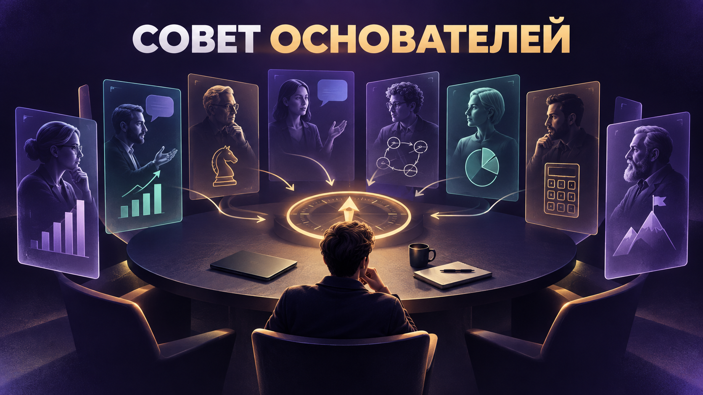

# Совет основателей



**ИИ-навык, который собирает вокруг вашей бизнес-задачи совет из 100 предпринимателей — и реконструирует не их цитаты, а способы мышления.**

   

Обычный бот ищет подходящую цитату. «Совет основателей» читает профиль человека целиком, выделяет его убеждения, ментальные модели, темперамент и способ объяснять — а затем достраивает, **как этот основатель мог бы разобрать именно вашу ситуацию**.

> Ответы навыка — честно обозначенная реконструкция, а не прямая речь реальных людей.

## Почему это не очередной сборник цитат

- **Мышление вместо открыток.** Профиль используется как камертон: важны логика, психология решений и характерные рамки.
- **Ответ под ваш контекст.** Один и тот же вопрос по-разному разбирается для фрилансера, онлайн-школы, эксперта или владельца небольшой команды.
- **Настоящее несогласие.** В совет подбираются не четыре одинаковых голоса, а релевантные оппоненты.
- **Разные способы объяснения.** Один основатель считает экономику, другой рисует схему, третий задаёт вопросы, четвёртый ломает исходную рамку.
- **Практический выход.** Итогом становится не вдохновение, а решение, эксперимент или первый шаг.


## Как это работает

1. Навык диагностирует реальную проблему за формулировкой пользователя.
2. По карте маршрутизации выбирает 3–4 релевантных основателя.
3. Читает их полные профили и собирает внутренние «карточки мышления».
4. При необходимости расширяет материал дополнительным исследованием.
5. Реконструирует разные ответы: расчёт, метафору, кейс, схему, таблицу или провокацию.
6. Показывает, где позиции сходятся, где конфликтуют и что сделать первым.

## Четыре режима

| Режим | Что происходит | Когда использовать |
|---|---|---|
| **Совет** | 3–4 основателя дают разные, развернутые рекомендации | Обычная бизнес-задача или решение |
| **Голосование ста** | Все 100 распределяются на «за», «против», «зависит» и «воздержался» | Нужно увидеть общий расклад мнений |
| **Глубокий разбор** | Один основатель подробно разбирает задачу, строит схему и план | Нужна одна система мышления |
| **Дебаты** | 2–3 основателя возражают друг другу по существу | Есть настоящая стратегическая дилемма |

## Что можно спросить

```text
Почему мой дорогой продукт смотрят, но не покупают? Собери совет из четырёх основателей.
```

```text
Устроить дебаты: мне оставаться экспертом-одиночкой или строить агентство?
```

```text
Как Алекс Хормози подробно пересобрал бы мой офер для консультации психолога?
```

```text
Проведи голосование ста: стоит ли мне поднимать цену в два раза?
```

```text
Я хочу нанять первого сотрудника. Дай мне расчёт, вопросы для решения и позицию человека, который со всеми поспорит.
```

## Что находится внутри

- **100 исследовательских профилей** по 2000–4000 слов каждый;
- **205 700 слов** исследовательской базы;
- **1049 ссылок** на книги, интервью, выступления, письма и другие источники;
- минимум три реальных кейса решений в каждом профиле;
- по 20 выводов и 20 практических советов на каждого основателя;
- карта маршрутизации по девяти бизнес-сферам;
- карта стратегических разногласий;
- отдельный QA-отчёт с ограничениями базы.

## Структура

```text
founders-council/
├── SKILL.md                  # Главная инструкция навыка
├── README.md                 # Эта страница
├── agents/
│   └── openai.yaml           # Название, описание, иконки и стартовый запрос
├── assets/
│   ├── icon.png
│   ├── hero.png
│   └── how-it-works.png
└── references/
    ├── index.md              # Индекс 001–100
    ├── routing.md            # Кого выбирать по задаче
    ├── debates.md            # Карта противоположных позиций
    ├── qa.md                 # Проверка и ограничения
    └── founders/             # 100 профилей
```

## Установка в Codex

Скопируйте папку репозитория в каталог навыков:

```text
~/.codex/skills/founders-council
```

Затем вызовите навык явно:

```text
$founders-council Разбери мою бизнес-задачу...
```

Навык также поддерживает автоматическое включение по релевантным запросам.

## Принцип честности

Навык различает:

- **реконструированный совет** — новое рассуждение в духе основателя;
- **реальную цитату** — только точная фраза с источником;
- **проверяемый факт** — дата, сумма, событие или решение компании.

Реконструкция может быть творческой, живой и полезной. Но выдуманная фраза не выдаётся за настоящую цитату, а выдуманное событие — за реальный кейс.

Полная логика находится в [SKILL.md](SKILL.md). Состав базы и качество источников описаны в [references/qa.md](references/qa.md).

